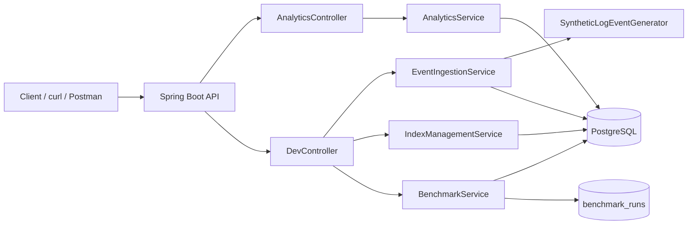

# DataLens - High-Performance Log & Event Analytics Engine
[](https://github.com/elyass1911-create/datalens-log-analytics/actions/workflows/ci.yml)

DataLens is a local-first log/event analytics engine built with Java 21, Spring Boot 4, and PostgreSQL. It ingests high-volume synthetic events (100K to 5M rows), serves real-time analytics APIs (error rate, top IPs, p95 latency, sliding windows), and includes benchmark + EXPLAIN tooling to compare query/index strategies in a reproducible way.

## Features

- High-volume ingestion with two modes:
  - JDBC batch insert (fast path)
  - JPA batch insert (reference path)
- Analytics endpoints for operational and security signals:
  - Error-rate time series
  - Top suspicious IPs
  - Top endpoints with average latency
  - P95 latency time series
  - Sliding-window error analytics
- Index profile manager for performance experiments:
  - `baseline` profile (minimal index)
  - `optimized` profile (analytics index set)
- Benchmark subsystem:
  - Repeated timings for scenarios
  - Mean / p95 / min / max metrics
  - Benchmark run persistence in `benchmark_runs`
- EXPLAIN ANALYZE endpoint for query plan visibility
- Integration tests with Testcontainers PostgreSQL (auto-skips if Docker unavailable)
- GitHub Actions CI workflow (`mvn test` + optional gitleaks scan)

## Architecture



## Tech Stack

- Java 21
- Spring Boot 4.0.3
- Maven
- PostgreSQL 16 (Docker Compose)
- Spring Data JPA + JdbcTemplate
- Flyway (schema/index migration ownership)
- Testcontainers (integration tests)

## Run Locally

1. Start PostgreSQL:

```bash
docker compose up -d
```

2. Start the app:

```bash
./mvnw spring-boot:run
```

The app listens on `http://localhost:8081`.

## Database / Docker

`docker-compose.yml` provisions:

- image: `postgres:16`
- db: `datalens`
- user/password: `datalens` / `datalens`
- port mapping: `5433:5432`
- persistent volume: `datalens_pgdata`

## Generate Synthetic Data

Seed 100K events via JDBC fast path:

```bash
curl -X POST "http://localhost:8081/api/dev/seed?n=100000&mode=jdbc&days=14"
```

Seed 250K via JPA batch mode:

```bash
curl -X POST "http://localhost:8081/api/dev/seed?n=250000&mode=jpa&days=30"
```

Example response:

```json
{
  "requested": 100000,
  "inserted": 100000,
  "mode": "jdbc",
  "elapsedMs": 3495,
  "totalRows": 100000
}
```

## Analytics API Examples

Health + row count:

```bash
curl "http://localhost:8081/api/analytics/health"
```

Error-rate time series:

```bash
curl "http://localhost:8081/api/analytics/error-rate?service=api&bucketMinutes=5"
```

Top IPs:

```bash
curl "http://localhost:8081/api/analytics/top-ips?limit=20"
```

P95 latency:

```bash
curl "http://localhost:8081/api/analytics/p95-latency?service=gateway&bucketMinutes=5"
```

Sliding-window errors:

```bash
curl "http://localhost:8081/api/analytics/sliding-window-errors?windowMinutes=15&stepMinutes=5"
```

## Index Profiles

Apply baseline profile:

```bash
curl -X POST "http://localhost:8081/api/dev/indexes/apply?profile=baseline"
```

Apply optimized profile:

```bash
curl -X POST "http://localhost:8081/api/dev/indexes/apply?profile=optimized"
```

Drop optimized indexes:

```bash
curl -X POST "http://localhost:8081/api/dev/indexes/drop?profile=optimized"
```

## Benchmarking

Run benchmark scenario:

```bash
curl -X POST "http://localhost:8081/api/dev/benchmark/run?scenario=errorRate&iterations=5"
```

Sample output:

```json
{
  "scenario": "errorRate",
  "profile": "baseline",
  "iterations": 5,
  "variants": [
    {"variant":"date_trunc_bucket","meanMs":13.91,"p95Ms":25.98,"minMs":10.29,"maxMs":25.98},
    {"variant":"generated_series_bucket","meanMs":8.1,"p95Ms":9.32,"minMs":7.32,"maxMs":9.32}
  ],
  "totalDurationMs": 111
}
```

### Deterministic Fixture (Real Assertions)

The test fixture in `src/test/resources/sql/deterministic_fixture.sql` is used to validate exact analytics behavior (not only shape/smoke).

Example expected output (`top-endpoints`):

```json
[
  {"endpoint":"/api/login","requestCount":4,"avgLatencyMs":250.0},
  {"endpoint":"/api/search","requestCount":3,"avgLatencyMs":500.0},
  {"endpoint":"/api/orders","requestCount":3,"avgLatencyMs":70.0}
]
```

Example expected output (`sliding-window-errors`, 5m window/step):

```json
[
  {"windowStart":"2026-01-01T00:00:00Z","totalCount":5,"errorCount":1},
  {"windowStart":"2026-01-01T00:05:00Z","totalCount":5,"errorCount":1},
  {"windowStart":"2026-01-01T00:10:00Z","totalCount":0,"errorCount":0}
]
```

Example expected output (`suspicious-ips`, top record):

```json
{"ip":"10.0.0.1","totalRequests":6,"authFailures":4,"maxRequestsPerMinute":3,"suspicionScore":13.1,"reasons":"auth_failures=4, max_rpm=3"}
```

### Benchmark Snapshot Template

| Dataset Size | Profile | Scenario | Variant | Mean (ms) | p95 (ms) |
| --- | --- | --- | --- | ---: | ---: |
| 100,000 | baseline | errorRate | date_trunc_bucket | 13.91 | 25.98 |
| 100,000 | baseline | errorRate | generated_series_bucket | 8.10 | 9.32 |
| 100,000 | optimized | errorRate | date_trunc_bucket | 12.16 | 16.42 |
| 100,000 | optimized | errorRate | generated_series_bucket | 54.24 | 221.58 |
| 100,000 | baseline | topIps | base | 14.08 | 14.49 |
| 100,000 | optimized | topIps | base | 9.69 | 13.72 |

## EXPLAIN ANALYZE

Error-rate explain:

```bash
curl "http://localhost:8081/api/dev/explain?scenario=errorRate&profile=optimized&variant=date_trunc_bucket"
```

Top-ips explain:

```bash
curl "http://localhost:8081/api/dev/explain?scenario=topIps&profile=optimized&variant=base"
```

Typical snippets:

```text
Bitmap Index Scan on idx_log_event_ts
Planning Time: 0.092 ms
Execution Time: 8.456 ms
```

```text
HashAggregate
Sort Method: top-N heapsort
Execution Time: 7.114 ms
```

## Performance & Optimization Findings

- `JDBC batch` ingestion is consistently faster than JPA batch for high cardinality inserts.
- `optimized` index profile improved `topIps` in this run (`mean 14.08ms -> 9.69ms`).
- For error-rate bucketing:
  - direct bucketing with epoch/trunc stayed stable (`~12-14ms`)
  - `generate_series` showed higher variance under optimized profile in this run
- EXPLAIN plans clearly show index usage differences between baseline and optimized profiles.

## Testing

Run all tests:

```bash
./mvnw test
```

Notes:

- Integration tests use Testcontainers PostgreSQL for correctness with Postgres SQL and query plans.
- If Docker is unavailable locally, container-based tests are skipped automatically.

## CI

GitHub Actions pipeline (`.github/workflows/ci.yml`):

- `mvn -B test`
- optional `gitleaks` scan (non-blocking)
- surefire reports uploaded as workflow artifact

## Finalization Flow

Use the repo script to generate real benchmark/explain/output artifacts:

```bash
pwsh ./scripts/final-proof.ps1 -BaseUrl http://localhost:8081 -Dataset 100000 -Iterations 5
```

Artifacts are written to `docs/proof/`. Final checklist: `docs/FINALIZATION.md`.

## CV-Ready Highlights

- Built a high-volume event analytics backend with dual ingestion paths (JDBC/JPA) up to multi-million rows.
- Designed and benchmarked query/index strategies using PostgreSQL native analytics SQL and EXPLAIN ANALYZE.
- Implemented reproducible performance experiments with index profile switching and persisted benchmark runs.
- Delivered production-style API layering, validation, error handling, integration tests, and CI automation.
- Demonstrated security-oriented analytics via suspicious IP heuristics and burst detection.
